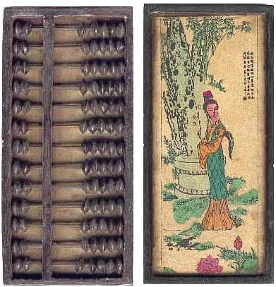
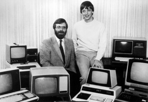

# Evolución histórica de la informática

En sus orígenes los **computadores** se basaban en las **tecnologías mecánica y electromecánica**. Sin embargo, hoy en día la tecnología mayoritariamente empleada es la **electrónica**, aunque ciertas partes del computador como son los periféricos todavía contienen gran **parte mecánica**. La **tecnología óptica** apunta como la tecnología del **futuro** de los computadores.

# LOS INICIOS DE LA INFORMÁTICA

El **ábaco**, inventado en China alrededor del año 2500 a.C., fue uno de los primeros sistemas de cálculo que utilizaba un aparato para realizar operaciones matemáticas. Este dispositivo permitía contar y almacenar datos, introduciendo los conceptos de memoria y almacenamiento. El ábaco estaba compuesto por varios ejes, cada uno con fichas que representaban números del 0 al 9. Los ejes correspondían a las unidades, decenas, centenas, y así sucesivamente, permitiendo representar números de manera sencilla mediante el movimiento de las fichas.

En 1642, *Blaise Pascal*, con solo 19 años, creó la primera máquina capaz de sumar. En concreto se creó la **Pascalina** denominada así en honor a su creador. Esta calculadora tenía las dimensiones de una caja de zapatos y en su interior disponía unas ruedas dentadas conectadas entre sí que formaban una cadena de transmisión. Las operaciones que permitía realizar eran la suma y la resta. En 1671 el matemático alemán *Gottfried W. Leibniz* mejoró la calculadora de Pascal creando la denominada **calculadora universal** que además de sumar y restar permitía multiplicar y dividir. Destacar que Leibniz fue el precursor del Sistema de Numeración Binario.

Pascalina

Lo más destacable del siglo XIX es la presencia de *Charles Babbage* considerado el padre y precursor de la computación moderna. Babbage diseñó dos máquinas que no llegaron a desarrollarse por completo por diferentes problemas la primera de ellas fue la **Máquina Diferencial** que permitía calcular tablas matemáticas y la segunda fue la **Máquina Analítica** cuya principal característica es que era una máquina programable a través de tarjetas perforadas capaz de hacer cualquier tipo de cálculo. Esta máquina contaba con diferentes elementos comunes a los ordenadores actuales como dispositivos de entrada, un procesador aritmético, una unidad de control, un mecanismo de salida y una memoria.

En 1890 bajo el respaldo comercial de "**Computing Tabulating Recording Corporation**", (CTR) aparece la **máquina tabuladora de *Herman Hollerith***, basada en los ensayos de Boole y Babbage. Con un sistema eléctrico trabajaba en binario a través de tarjetas perforadas, asociando los diferentes estados lógicos (verdadero (1) y falso (0)) a la presencia o no de perforaciones. En 1924, la compañía **CTR, pasó** a **llamarse International Business Machine**, más popularmente conocida como **IBM**.

Máquina tabuladora de *Herman Hollerith*

**Siglo XX.**

A mediados del Siglo XX se produce una explosión en el desarrollo y construcción de dispositivos de cálculo y podemos hablar de varias generaciones de ordenadores:

# GENERACIONES DE LOS ORDENADORES

Las generaciones de ordenadores representan la evolución tecnológica de estos dispositivos desde sus inicios hasta la actualidad. Cada generación ha traído consigo avances significativos que han transformado la manera en que interactuamos con la tecnología y cómo esta influye en nuestras vidas.

La primera generación de ordenadores se caracterizó por ser grandes y costosos, con una capacidad de procesamiento limitada. A medida que la tecnología avanzaba, los ordenadores de la segunda generación se volvieron más pequeños y eficientes, permitiendo un uso más amplio en diversas industrias.

La tercera generación marcó un hito importante con la introducción de componentes más avanzados que mejoraron la velocidad y la eficiencia de los ordenadores. Esto hizo que fueran más accesibles para empresas y universidades, fomentando un mayor desarrollo en el campo de la informática.

Con la cuarta generación, los ordenadores personales se convirtieron en una realidad, revolucionando tanto el ámbito profesional como el doméstico. La capacidad de procesamiento aumentó significativamente, y el software se volvió más sofisticado, permitiendo una amplia gama de aplicaciones.

Finalmente, la quinta generación se centra en la inteligencia artificial y la computación avanzada. Esta generación busca crear sistemas que puedan aprender y adaptarse, abriendo nuevas posibilidades en campos como la robótica, el aprendizaje automático y los sistemas expertos.

Cada generación ha contribuido a hacer que los ordenadores sean más potentes, accesibles y esenciales en nuestra vida diaria. ¿Te gustaría profundizar en algún aspecto específico de esta evolución?

## 1ª Generación (1946-1955)

Se desarrollaron computadores electrónicos basados en **válvulas de vacío** en los que se introducía la información a través de tarjetas perforadas. Es un componente que tiene dos extremos de trabajo límite (corte y saturación), que se van a relacionar con los valores lógicos 0 y 1, que conforman el sistema binario, para su posterior tratamiento con el álgebra de Boole.

[https://www.youtube.com/watch?v=AuMVvq-h5Mo](https://www.youtube.com/watch?v=AuMVvq-h5Mo)

https://www.youtube.com/watch?v=AuMVvq-h5Mo

Máquinas de esta generación:

**MARK I, II Y III,   COLOSSUS, ENIAC** (tecnología electrónica basada en válvulas de vacío), **UNIVAC I, Z4, EDVAC, IMB701, Z22...**

*La máquina Mark I tenía 2,5 metros de alto y 17 metros de largo, pesaba 31500 kg, contenía 800 km de cable aproximadamente y tenía más de 3.000.000 de conexiones.*

Cabe destacar a John Von Neumann que presentó la arquitectura Von Neuman en la que se basan los ordenadores actuales.

---

## 2ª Generación (1955-1965)

Se sustituyen las válvulas de vacío por un componente electrónico “**el transistor”**. Su fabricación y funcionamiento está basado en el elemento más abundante en la naturaleza: el silicio.

Consiguió reducir costes ya que la materia prima era barata (tanto como un puñado de arena). Además, el sistema de producción era menos complejo.

Ventajas del transistor con respecto a la válvula de vacío:

Más barato, Menor consumo de energía, Mayor rapidez de operación, Menor tamaño, Más fiable, Más fácil de manipular para el ser humano. (las válvulas trabajaban con altas tensiones con el consiguiente riesgo de electrocución) y comienzan a utilizarse las memorias de ferrita.

Aparece el concepto de procesamiento por lotes que sustituye a las tarjetas perforadas.

Máquinas de esta generación:

**TRADIC, IBM1401, HONEYWELL800, IMB1620…**

[https://www.youtube.com/watch?v=MukEdpELaMM](https://www.youtube.com/watch?v=MukEdpELaMM)

https://www.youtube.com/watch?v=MukEdpELaMM

---

## 3ª Generación (1964-1974)

Lo más destacable de esta tercera generación es que aparecen los **circuitos integrados** en sustitución de los transistores (chip). Una máquina importante es el IBM 360 que era capaz de realizar cualquier cálculo aritmético-lógico.

A mediados de los 70 aparece un nuevo tipo de ordenador de proporciones más reducidas que las máquinas conocidas hasta el momento (mainframes).

Se trata de los miniordenadores domésticos actuales (ordenadores personales o PC).

Máquinas de esta generación:

**UNIVAC 1110, IBM 360, CDC6600, HONEYWELL6000…**

[https://www.youtube.com/watch?v=FlF5ePFLzO4](https://www.youtube.com/watch?v=FlF5ePFLzO4)

https://www.youtube.com/watch?v=FlF5ePFLzO4

https://www.youtube.com/watch?v=LqaRELYZ1yE

---

## 4ª Generación (1974-1983)

Aparecen las memorias de semiconductores que sustituyen a las de ferrita y se produce una gran integración de los componentes del computador. Aparecen los **microprocesadores**. La gran ventaja que representa la aparición del microprocesador, es de un incremento importante en velocidad, ahorro de consumo y potencia de cálculo, la reducción espectacular de tamaño y coste. Tal ha sido el cambio aportado por el microprocesador que esta etapa se ha denominado la de la "revolución informática".

Aparece la tecnología de **montaje de circuitos impresos SMT** (tecnología montaje superficial) que sustituye a los componentes discretos, que logra una gran reducción del tamaño de los componentes electrónicos y del espacio ocupado por los circuitos impresos.

El software sigue evolucionando y **aparecen compañías como Microsoft, Apple…**

---

## 5ª Generación (1983-Actualidad)

Se lleva a cabo una gran miniaturización de los componentes hardware que permite afirmar que se está alcanzando el límite de integración. Actualmente se trabaja en el **procesamiento en paralelo** y en nuevas filosofías de **computación cuántica** o la **Inteligencia Artificial** (IA).

Durante la década de los 80's aparecen las primeras versiones del **sistema Operativo Windows**, OS/2. Se produce la comercialización de los ordenadores Macintosh que incorporaban el sistema operativo **MAC OS**.

Durante la década de los 90'´s surge el boom de internet y del comercio electrónico. Se crea la compañía Google y aparecen importantes versiones del **sistema operativo Windows 95, 98, NT** y Microsoft saca al mercado el sistema operativo Windows LE destinados a los móviles. Aparece el **sistema Operativo Linux.**

A partir del año 2000 aparecen los sistemas operativos **Windows 2000, Windows XP, 7, 8, 8.1 y 10**. Aparecen nuevas distribuciones del sistema operativo Linux y comienza a ser rival para Windows. Evolucionaron los **dispositivos móviles** y aparecieron en el mercado **sistemas operativos** destinados a estos dispositivos, como fueron: **BlackBerry OS, Android, iOS, Windows Phone,** etc. Durante esta época evolucionaron las conexiones a internet.

---

# VIDEO: Historia de la informática

[https://www.youtube.com/watch?v=6sTPEtzNIsA#t=8s](https://www.youtube.com/watch?v=6sTPEtzNIsA#t=8s)

https://www.youtube.com/watch?v=6sTPEtzNIsA#t=8s